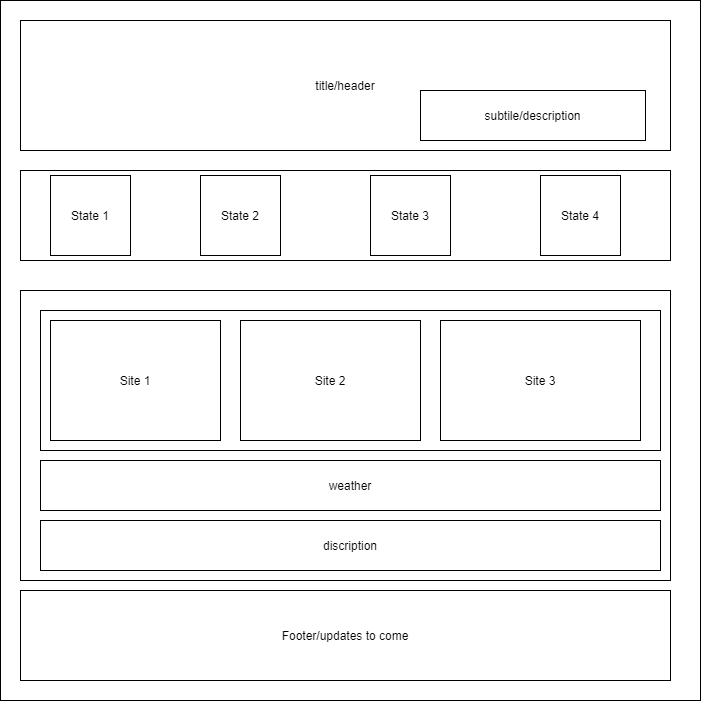
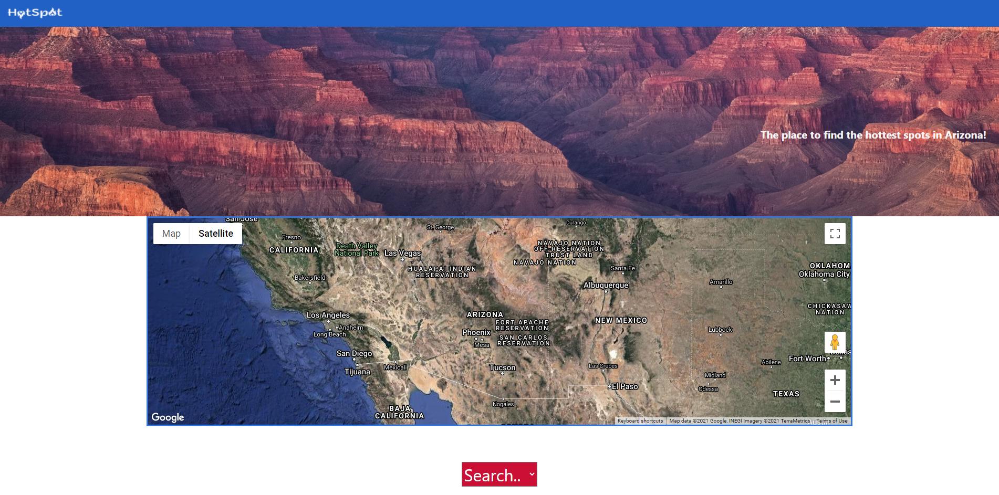
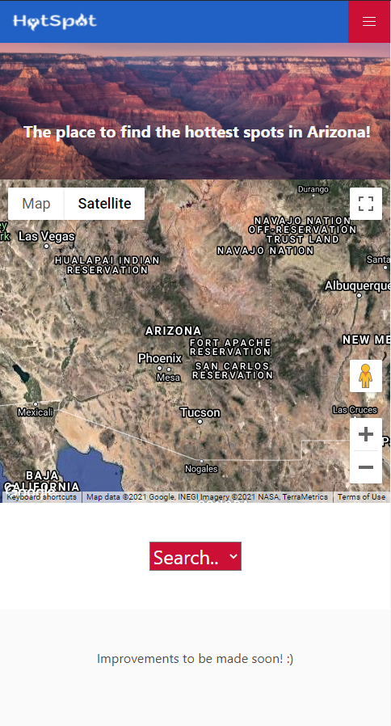
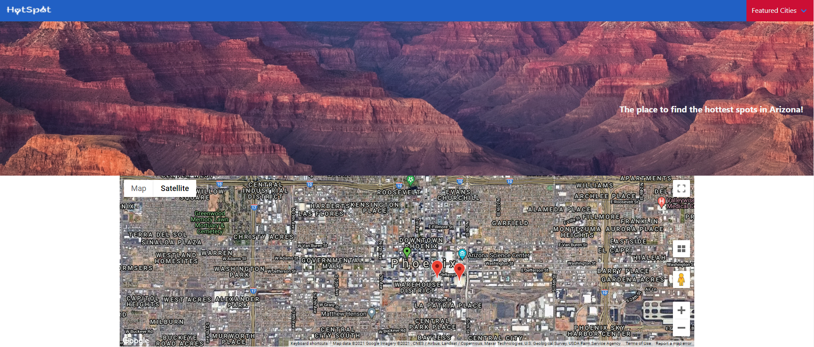
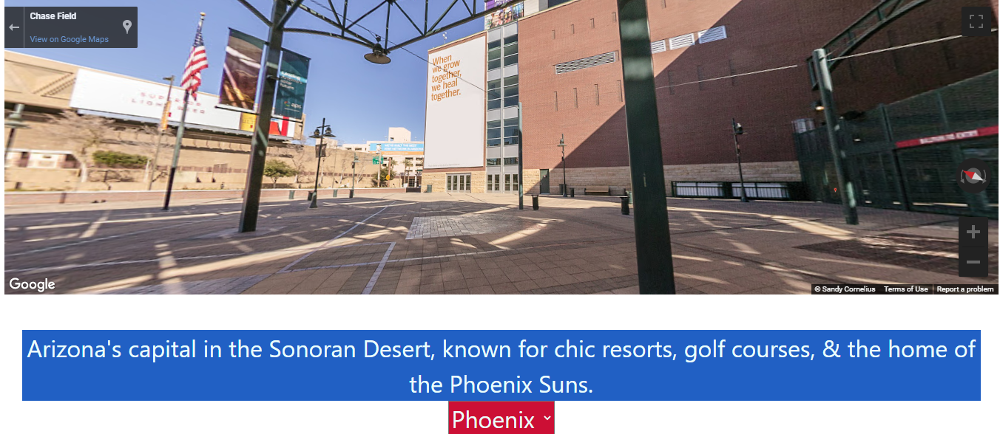

# Hot-Spot

## U of A Boot Camp First Group Development

## User Story

As a tourist on vacation, I want an easy way to learn about the city I'm visiting and some suggestions for places to visit so that I can plan out my vacation time accordingly.

## Description 

## Usage 

# Screenshots

## Wireframe

## Home Page

## Mobile version

## Satellite Map

## Street View

# Built With
    HTML
    CSS
    BULMA
    JAVASCRIPT
    GOOGLE MAPS

##  Created by:

    Bryan Daniel
    Alec Stewart
    & Brent Albers

