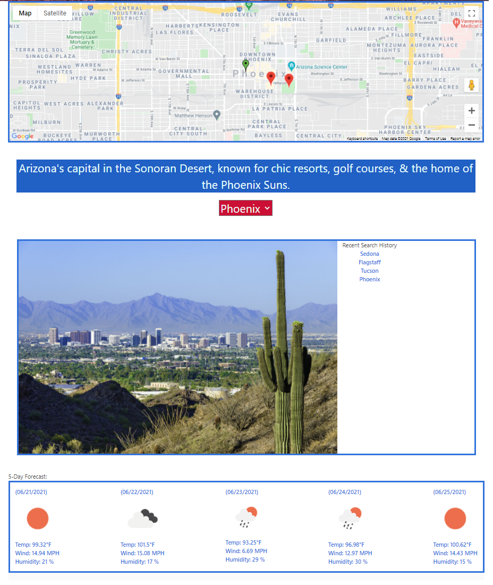

# Hot-Spot

## U of A Boot Camp First Group Development

## User Story

As a tourist on vacation, I want an easy way to learn about the city I'm visiting and some suggestions for places to visit along with how the weather is looking so that I can plan out my vacation time accordingly.

# Screenshots

## Wireframe

## Home Page

## Locations and Weather

## Street View

## Installation

[Click here to reach the github repository](https://github.com/AZBDaniel/hot-spot.git)

[Click here to view the published version of HotSpot](https://azbdaniel.github.io/hot-spot/)

# Built With
    HTML
    CSS
    BULMA.IO
    JAVASCRIPT
    GOOGLE MAPS
    OPENWEATHER

##  Created by:

    Bryan Daniel
    Alec Stewart
    & Brent Albers

